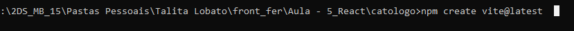
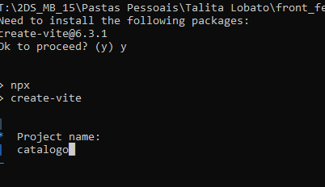
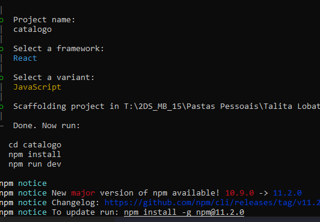
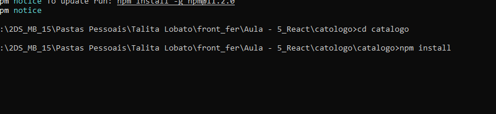
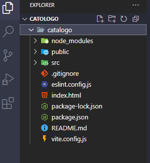
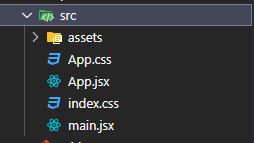

# React

**React é uma biblioteca JavaScript de código aberto para a construção de interfaces de usuário, especialmente para aplicações web. Desenvolvida e mantida pelo Facebook, React permite que os desenvolvedores criem componentes reutilizáveis que gerenciam seu próprio estado, facilitando a construção de interfaces interativas e dinâmicas.**

**### Principais Características do React**

- **Componentes Reutilizáveis**: O
React permite que você crie componentes que podem ser reutilizados em
diferentes partes da aplicação, o que economiza tempo e esforço no
desenvolvimento.
- **JSX**: O React utiliza JSX, uma extensão de sintaxe que combina JavaScript e HTML, facilitando a
criação de elementos de interface de forma mais intuitiva.
- **Virtual DOM**: O React
implementa um Virtual DOM, que é uma representação leve do DOM real.
Isso permite que o React atualize apenas as partes da interface que
mudaram, melhorando o desempenho.
- **Unidirecional**: O fluxo de
dados no React é unidirecional, o que significa que os dados fluem em
uma única direção, facilitando a depuração e a compreensão do estado da
aplicação.

### Como o React Funciona

- **Componentes**: Os componentes
são a base do React. Cada componente pode ter seu próprio estado e
propriedades, permitindo que você crie interfaces complexas de forma
organizada.
- **Renderização**: Quando o estado de um componente muda, o React re-renderiza apenas aquele componente e
seus filhos, em vez de atualizar toda a árvore DOM.
- **Gerenciamento de Estado**: O
React permite o gerenciamento de estado local dentro dos componentes,
além de integrar bibliotecas externas como Redux ou Recoil para
gerenciamento de estado mais complexo.

### Vantagens do Uso do React

- **Desempenho**: O uso do Virtual DOM e a atualização eficiente da interface resultam em aplicações mais rápidas e responsivas.
- **SEO Amigável**: O React pode
ser configurado para ser amigável aos mecanismos de busca, o que é uma
vantagem significativa para aplicações web.
- **Comunidade e Ecossistema**: O
React possui uma grande comunidade de desenvolvedores e um vasto
ecossistema de bibliotecas e ferramentas que facilitam o
desenvolvimento.

### Comparação com React Native

- **ReactJS**: Focado em aplicações web, utiliza o Virtual DOM e permite o uso de HTML e CSS.
- **React Native**: Focado em
desenvolvimento de aplicativos móveis, utiliza APIs nativas para
renderizar componentes e não usa HTML, mas sim componentes específicos
para cada plataforma.

### Conclusão

O React é uma ferramenta poderosa para o 
desenvolvimento de interfaces de usuário, oferecendo uma abordagem 
modular e eficiente. Sua popularidade e suporte contínuo o tornam uma 
escolha sólida para desenvolvedores que buscam criar aplicações web 
dinâmicas e responsivas.

##

### Passo a Passo de instalção 
- criei uma pasta chamada catalogo pode ser qualquer coisa depende do projeto


- subtituir nome



- selecionar com as setinhas



- instalando o vite



- vai aparecer um endereco **cltrl + mouse** e baixando react !!!
- executar ```npm run dev```


**Oque deve aparecer !**


#

- dentro da catalogo vai ter outra catalogo kk ( obs: o nome do projeto e opcional )



- visto isso voce comclui as instalações

- dentro da pasta src voce irá começar seu desenvolvimento.
### **A pasta src em projetos React é o local onde você deve colocar o código fonte da sua aplicação, incluindo componentes, páginas, estilos e outros arquivos**




- Estrutura de pastas e arquivos


